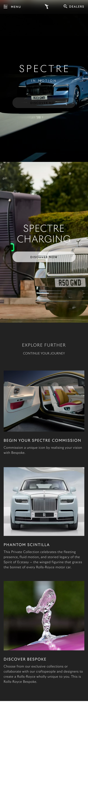

# Procesverslag
Markdown is een simpele manier om HTML te schrijven.  
Markdown cheat cheet: [Hulp bij het schrijven van Markdown](https://github.com/adam-p/markdown-here/wiki/Markdown-Cheatsheet).

Nb. De standaardstructuur en de spartaanse opmaak van de README.md zijn helemaal prima. Het gaat om de inhoud van je procesverslag. Besteedt de tijd voor pracht en praal aan je website.

Nb. Door *open* toe te voegen aan een *details* element kun je deze standaard open zetten. Fijn om dat steeds voor de relevante stuk(ken) te doen.

## Jij

  
uitwerken voor kick-off werkgroep

  ### Auteur:
  Mariska Boelhouwers

  #### Je startniveau:
  rood/zwart 

  #### Je focus:
  responsive
 

## Je website

  
uiterken voor kick-off werkgroep

  ### Je opdracht:
  link naar de website die je gaat namaken óf de naam/omschrijving van je eigen ontwerp

  https://www.rolls-roycemotorcars.com/en_GB/home.html
[text](https://www.rolls-roycemotorcars.com/content/dam/rrmc/marketUK/rollsroycemotorcars_com/6-11-complaints-procedure/page-properties/rrmc-complaints-procedures-hero-m.jpg/jcr%3Acontent/renditions/original)
  #### Screenshot(s) van de eerste pagina (small screen): 
  home  
  

  #### Screenshot(s) van de tweede pagina (small screen):
  models 
  
 

## Toegankelijkheidstest 1/2 (week 1)

  
uitwerken na test in 2e werkgroep

  ### Bevindingen
  Lijst met je bevindingen die in de test naar voren kwamen:
  1. het was best ingewikkeld om een screenreader te gebruiken. zeker omdat ik het nog nooit gebruikt had

  2. de screenreaader las als een van de eerste dingen de links uit de footer voor en de website scrolde niet mee naar aar op de site deze stonden.

  3. er is wel een visuele aanduiding voor de focus maar de website scrolt vaak niet automatisch door naar waar op de website de focus ligt dus

  4. de website houd ook geen rekening met de voorkeuren van de gebruiker. er is bijvoorbeeld geen verandering te zien al kies je darkmode of lightmode ook is er niks gedaan voor reduced motion zoals minder animaties of geen achtergrond videos

  5. er missen best wat dingen qua toegangkelijkheid op deze website

## Breakdownschets (week 1)

  
uitwerken na afloop 3e werkgroep

  ### de hele pagina: 
  

  ### dynamisch deel (menu klein): 
  

  ### wellicht nog een dynamisch deel (menu groot): 
  

## Voortgang 1 (week 2)

  
uitwerken voor 1e voortgang

  ### Stand van zaken
  ik heb al een redelijk goed begin gemaakt voor mijn eerste pagina door de html te schrijven en alvast een beetje css toe te passen 

  ### Verslag van meeting
  hier na afloop snel de uitkomsten van de meeting vastleggen

  ik ben goed onderweg
  had tot nu toe niet echt vragen

## Voortgang 2 (week 3)

  
uitwerken voor 2e voortgang

  ### Stand van zaken
  het schrijven van de code gaat prima maar ik heb wat moeite met het kiezen van een 2e pagina

  ### Verslag van meeting
  hier na afloop snel de uitkomsten van de meeting vastleggen

  -ik mag niet de 2e laag van het hamburgermenu kiezen als 2e pagina
  

## Toegankelijkheidstest 2/2 (week 4)

  
uitwerken na test in 9e werkgroep

  ### Bevindingen
  Lijst met je bevindingen die in de test naar voren kwamen (geef ook aan wat er verbeterd is):

## Voortgang 3 (week 4)

  
uitwerken voor 3e voortgang

  ### Stand van zaken
  ik heb wat problemen met het maken vn een custom curser verder gaat het wel oke

  ### Verslag van meeting
  hier na afloop snel de uitkomsten van de meeting vastleggen

  -heb wat ideeen voor de cursor
  -ik loop mischien een beetje achter

## Eindgesprek (week 5)

  
uitwerken voor eindgesprek

  ### Je uitkomst - karakteristiek screenshots:
  

  ### Dit ging goed/Heb ik geleerd: 
  Korte omschrijving met plaatjes

  

  ### Dit was lastig/Is niet gelukt:
  Korte omschrijving met plaatjes

  

## Bronnenlijst

  
continu bijhouden terwijl je werkt

  Nb. Wees specifiek ('css-tricks' als bron is bijv. niet specifiek genoeg). 
  Nb. ChatGpT en andere AI horen er ook bij.
  Nb. Vermeld de bronnen ook in je code.

  1. bron 1
  2. bron 2
  3. ...

